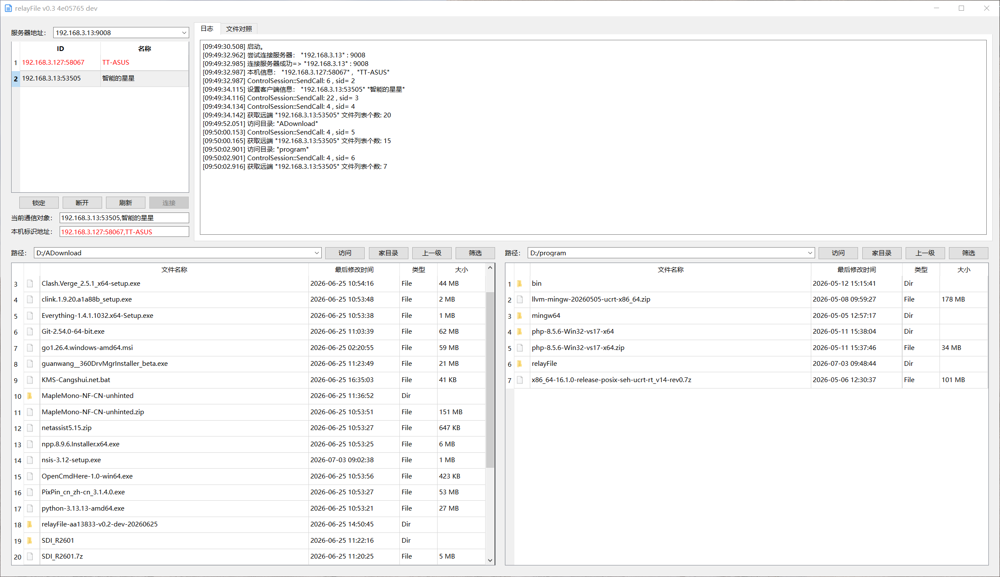
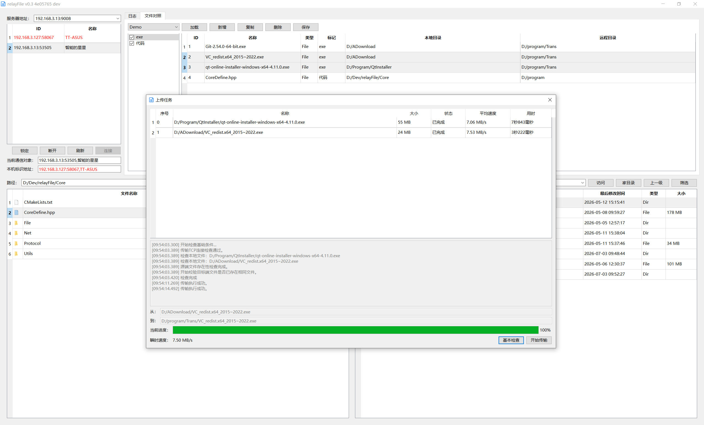
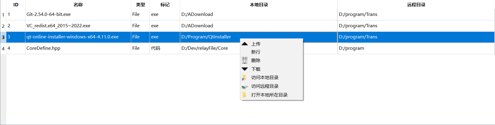
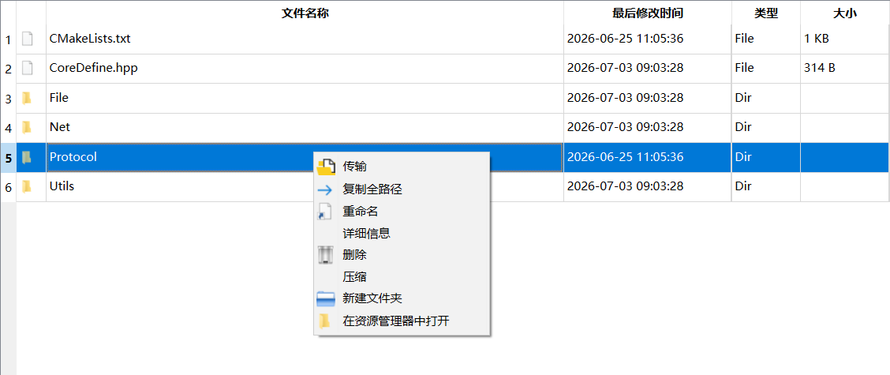
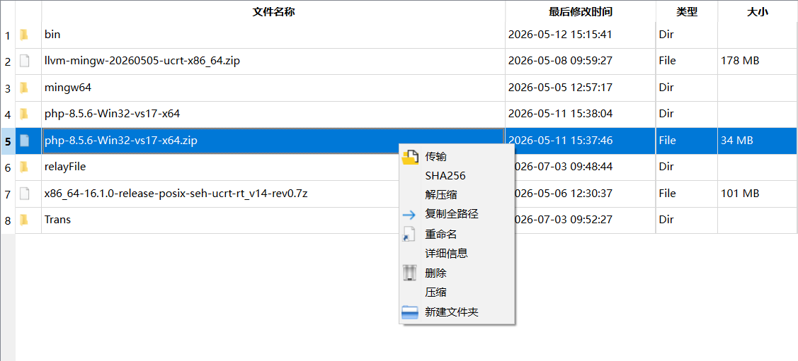
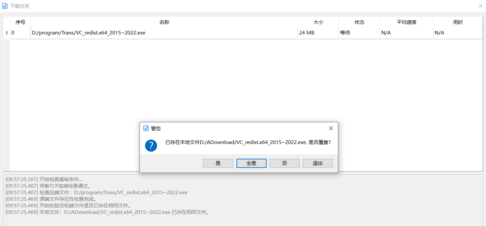

# relayFile

一个通过中继服务器在多个客户端之间相互传输文件的工具。

## 功能特点

1. 极简配置——只需启动服务器，连接至服务器，即可开始传输文件。
2. **提供本地-远程文件映射配置功能，支持一键传输，用于频繁传输相同的文件**（本工具开发主要初衷）。
3. 构建简单，只依赖C++17编译器和`QtBase`组件，依赖的外部代码均已内置。

## 组件

目前项目构建有三个二进制结果：

| 名称            | 类型   | 功能                                                         |
| --------------- | ------ | ------------------------------------------------------------ |
| relayFileServer | 控制台 | 中继服务器。                                                 |
| relayFileClient | 控制台 | 命令行客户端，没有操作功能，一般配合另外一个带GUI的客户端使用。 |
| relayFileGui    | GUI    | GUI客户端。                                                  |

计划会增加一个无Qt依赖的中继服务器`relayFileServerAlone`版本，用于方便在服务器上部署中继服务器。

## 其他

`relayFile`是 [frelay传输工具 (XP支持)](https://github.com/taynpg/frelay) 的重新整理优化版本并去除了XP支持，以便可以更好的使用新标准和语法。

`relayFile`目前仅在`Qt6`上编译测试通过，理论上`Qt5`也可以但并不保证。

主要优化内容：

- 1.控制链接和传输链接分开处理，避免网络阻塞时控制消息排队难以到达的问题。
- 2.传输模拟改为一帧一应答的方式，避免数据包堆积在中继服务器。
- 3.去除一些麻烦的构建依赖和配置。

## 警告与说明

本工具仅设计用于通过中继服务器在客户端之间进行简单的文件传输，未包含可防范数据攻击或类似威胁的安全验证逻辑，主要适用于临时性、非敏感的文件传输场景。请在不使用时及时关闭软件或断开与中继服务器的连接。

**本软件可能存在意外错误或者BUG，尤其是未达到`v1.0`版本之前，可能导致文件损坏或丢失。**请务必做好文件备份，或仅将其用于非关键文件的传输。

## 一些示例图

